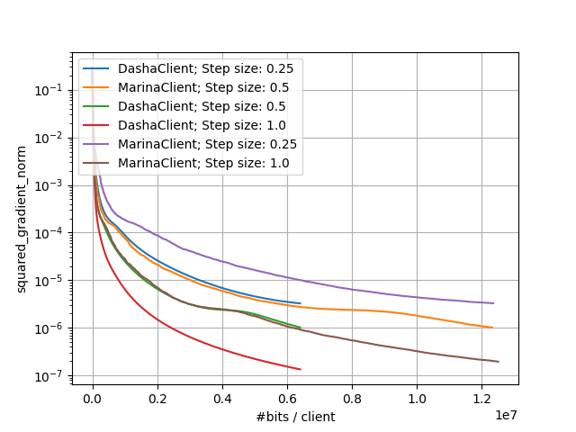
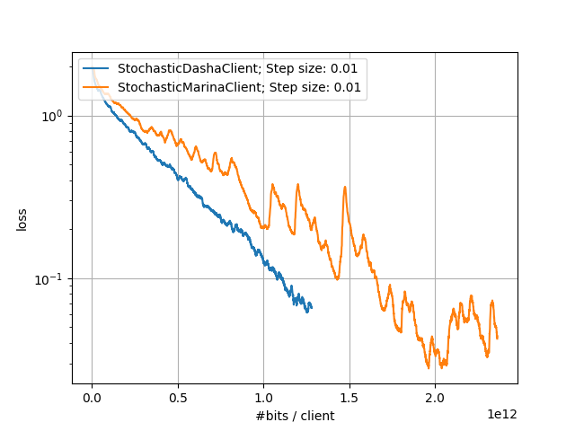

# DASHA: Distributed Nonconvex Optimization with Communication Compression and Optimal Oracle Complexity

> Note: If you use this baseline in your work, please remember to cite the original authors of the paper as well as the Flower paper.

**Paper:** [openreview.net/forum?id=VA1YpcNr7ul](https://openreview.net/forum?id=VA1YpcNr7ul)

**Authors:** Alexander Tyurin, Peter Richtárik

**Abstract:** We develop and analyze DASHA: a new family of methods for nonconvex distributed optimization problems. When the local functions at the nodes have a finite-sum or an expectation form, our new methods, DASHA-PAGE, DASHA-MVR and DASHA-SYNC-MVR, improve the theoretical oracle and communication complexity of the previous state-of-the-art method MARINA by Gorbunov et al. (2020). In particular, to achieve an $\varepsilon$-stationary point, and considering the random sparsifier Rand$K$ as an example, our methods compute the optimal number of gradients $O\left(\frac{\sqrt{m}}{\varepsilon\sqrt{n}}\right)$ and $O\left(\frac{\sigma}{\varepsilon^{\frac{3}{2}}n}\right)$ in finite-sum and expectation form cases, respectively, while maintaining the SOTA communication complexity $O\left(\frac{d}{\varepsilon \sqrt{n}}\right)$. Furthermore, unlike MARINA, the new methods DASHA, DASHA-PAGE and DASHA-MVR send compressed vectors only, which makes them more practical for federated learning. We extend our results to the case when the functions satisfy the Polyak-Lojasiewicz condition. Finally, our theory is corroborated in practice: we see a significant improvement in experiments with nonconvex classification and training of deep learning models.


## About this baseline

**What’s implemented:** The code in this directory implements the experiments from the DASHA paper.

**Datasets:** Mushrooms from LIBSVM and CIFAR10 from PyTorch's Torchvision

**Hardware Setup:** These experiments were run on a desktop machine with 64 CPU cores. Any machine with 1 CPU would be able to run this code with the mushrooms dataset. The experiments with CIFAR10 would require slightly more CPU resources (e.g., 4 cores would be sufficient) and 1 GPU with CUDA.

**Contributors:** Alexander Tyurin ([https://github.com/k3nfalt](https://github.com/k3nfalt))


## Experimental Setup

**Task:** Image Classification and Linear Regression

**Model:** This baseline implements two models:

* A logistic regression model with a nonconvex loss from the DASHA paper (Section A.1).
* A neural network with the cross entropy loss (Section A.4).

**Dataset:** This baseline only includes the MNIST dataset. By default, the datasets are partitioned randomly between $n$ clients:

| Dataset | #classes | partitioning method |
| :------ | :---: | :---: |
| mushrooms | 2 | random |
| CIFAR10 | 10 | random |

**Training Hyperparameters:** In all experiments, we take parameters of algorithms predicted by the theory, except for the step sizes. In the case of the mushrooms's experiments, the step sizes are fine-tuned from the set of powers of two $\{0.25,0.5,1.0\}.$ In the case of CIFAR10's experiments, the step sizes are fixed to $0.01.$


## Environment Setup

To construct the Python environment follow these steps:

```bash
# Set Python 3.10
pyenv local 3.10.6
# Tell poetry to use python 3.10
poetry env use 3.10.6
# Install the base Poetry environment
# By default, Poetry installs the PyTorch package with Python 3.10 and CUDA 11.8.
# If you have a different setup, then change the "torch" and "torchvision" lines in [tool.poetry.dependencies].
poetry install

# Activate the environment
poetry shell
```


## Running the Experiments

To run this FedProx with MNIST baseline, first ensure you have activated your Poetry environment (execute `poetry shell` from this directory), then:

```bash
python -m dasha.main # this will run using the default settings in `dasha/conf`

# you can override settings directly from the command line
# The following commands runs an experiment with the step size 0.5.
# Instead of the full, non-compressed vectors, each node sends a compressed vector with only 10 coordinates.
python -m dasha.main method.strategy.step_size=0.5 compressor.number_of_coordinates=10

# if you run this baseline with a larger model, you might want to use the GPU (not used by default).
python -m dasha.main method.client.device=cuda
```

To run using MARINA by Gorbunov et al. (2020):
```bash
python -m dasha.main method=marina
```


## Expected Results
### Small-Scale Experiments

With the following command we run both DASHA and MARINA methods while iterating through different values of `step size`. Other parameters are the same as in the original paper. In the following command, we also ask the clients to send the full gradients to evaluate the norm of gradients metric.

```bash
# Run experiments
python -m dasha.main --multirun method=dasha,marina compressor.number_of_coordinates=10 method.strategy.step_size=0.25,0.5,1.0 method.client.send_gradient=true
# The previous script output paths to the results (ex: multirun/2023-09-16/10-39-30/1 multirun/2023-09-16/10-39-30/2 ...).
# Plot results
python -m dasha.plot --input_paths multirun/2023-09-16/10-39-30/1 multirun/2023-09-16/10-39-30/2 --output_path plot.png --metric squared_gradient_norm
# or it is sufficient to give the common folder as input
python -m dasha.plot --input_paths multirun/2023-09-16/10-39-30 --output_path plot.png --metric squared_gradient_norm
```

<!---/home/tyurina/rsync_watch/flower/baselines/multirun/2023-09-21/21-36-57--->

The above commands would generate results that you can plot and would look like:

| *Small-Scale Experiments: Comparison of DASHA and MARINA* |
|:--:| 
|  | 

### Large-Scale Experiments

In the following experiments, we compare the performance of DASHA and MARINA on the CIFAR10 dataset.

```bash
# Run experiments
python -m dasha.main method.strategy.step_size=0.01 method=stochastic_dasha num_rounds=10000 compressor.number_of_coordinates=2000000 model=resnet_18_with_logistic_loss method.client.strict_load=false dataset=cifar10 method.client.device=cuda method.client.evaluate_accuracy=true local_address=localhost:8001 method.client.mega_batch_size=16
python -m dasha.main method=stochastic_marina method.strategy.step_size=0.01 num_rounds=10000 compressor.number_of_coordinates=2000000 model=resnet_18_with_logistic_loss method.client.strict_load=false dataset=cifar10 method.client.device=cuda method.client.evaluate_accuracy=true local_address=localhost:8002
# The previous scripts output paths to the results. We define them as PATH_DASHA and PATH_MARINA
# Plot results
python -m dasha.plot --input_paths PATH_DASHA PATH_MARINA --output_path plot_nn.png --smooth-plot 100
```

<!---/home/tyurina/hydra_outputs/2023-08-28/21-54-53 /home/tyurina/hydra_outputs/2023-08-29/09-24-27--->

| *Large-Scale Experiments: Comparison of DASHA and MARINA* |
|:--:| 
|  | 