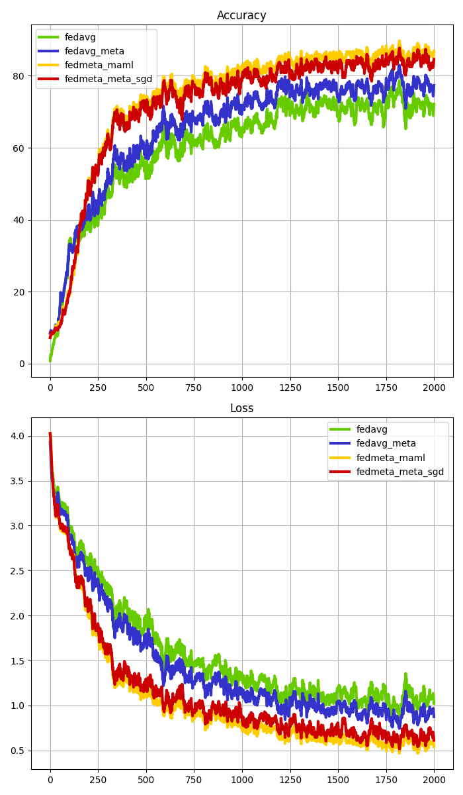
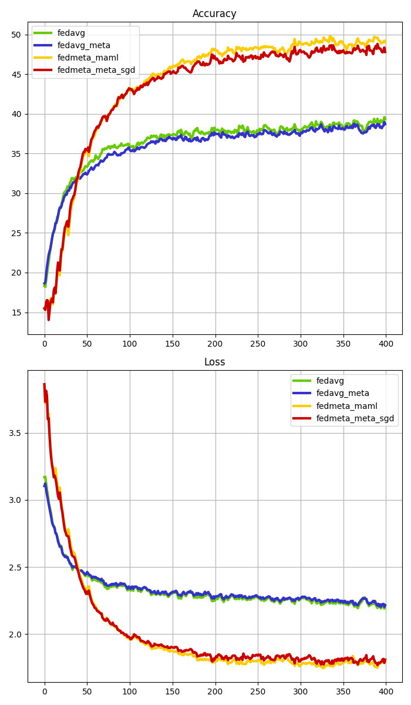

# FedMeta: Federated Meta-Learning with Fast Convergence and Efficient Communication

****Paper:**** : [arxiv.org/abs/1802.07876](https://arxiv.org/abs/1802.07876)

****Authors:**** :Fei Chen, Mi Luo, Zhenhua Dong, Zhenguo Li, Xiuqiang He

****Abstract:**** :Statistical and systematic challenges in collaboratively training machine learning models across distributed networks of mobile devices have been the bottlenecks in the real-world application of federated learning. In this work, we show that meta-learning is a natural choice to handle these issues, and propose a federated meta-learning framework FedMeta, where a parameterized algorithm (or meta-learner) is shared, instead of a global model in previous approaches. We conduct an extensive empirical evaluation on LEAF datasets and a real-world production dataset, and demonstrate that FedMeta achieves a reduction in required communication cost by 2.82-4.33 times with faster convergence, and an increase in accuracy by 3.23%-14.84% as compared to Federated Averaging (FedAvg) which is a leading optimization algorithm in federated learning. Moreover, FedMeta preserves user privacy since only the parameterized algorithm is transmitted between mobile devices and central servers, and no raw data is collected onto the servers.


## About this baseline 

****What’s implemented:**** : We reimplemented the experiments from the paper 'FedMeta: Federated Meta-Learning with Fast Convergence and Efficient Communication' by Fei Chen (2018). which proposed the FedMeta(MAML & Meta-SGD) algorithm. Specifically, we replicate the results from Table 2 and Figure 2 of the paper.

****Datasets:**** : FEMNIST and SHAKESPEARE from Leaf Federated Learning Dataset

****Hardware Setup:**** : These experiments were run on a machine with 16 CPU threads and 1 GPU(GeForce RTX 2080 Ti). **However, the FedMeta experiment using the Shakespeare dataset required more computing power (more than 4 GPUs).** Out of Memory errors may occur with some clients, but federated learning can continue to operate.

****Contributors:**** : **Jinsoo Kim and Kangyoon Lee**


## Experimental Setup

****Task:**** : A comparison task of four algorithms(FedAvg, FedAvg(Meta), FedMeta(MAML), FedMeta(Meta-SGD)) in the categories of Image Classification and next-word prediction.

****Model:**** :This directory implements two models:
* A two-layer CNN network as used in the FedMeta paper for Femnist (see `models/CNN_Network`).
* A StackedLSTM model used in the FedMeta paper for Shakespeare (see `models/StackedLSTM`).

**You can see more detail in Apendix.A of the  paper**

****Dataset:**** : This baseline includes the FEMNIST dataset and SHAKESPEARE. For data partitioning and sampling per client, we use the Leaf GitHub([LEAF: A Benchmark for Federated Settings](https://github.com/TalwalkarLab/leaf)). The data and client specifications used in this experiment are listed in the table below (Table 1 in the paper).

**Shakespeare Dataset Issue** : In the FedMeta paper experiment, the Shakespeare dataset had 1126 users. However, due to a current bug, the number of users has decreased to 660 users. Therefore, we have only maintained the total number of data.

|   Dataset   |      #Clients       |     #Samples     | #Classes |                      #Partition Clients                      | #Partition Dataset   |
|:-----------:|:-------------------:|:----------------:|:--------:|:------------------------------------------------------------:|----------------------|
|   FEMNIST   |    About<br>1050    | About<br>240,000 |    62    | Train Clients : 0.8, Valid Clients : 0.1, Test Clients : 0.1 | Sup : 0.2, Qry : 0.8 |
| SHAKESPEARE | About<br>550 -> 110 | About<br>620,000 |    80    | Train Clients : 0.8, Valid Clients : 0.1, Test Clients : 0.1 | Sup : 0.2, Qry : 0.8 |

**The original specifications of the Leaf dataset can be found in the Leaf paper(_"LEAF: A Benchmark for Federated Settings"_).**

****Training Hyperparameters:**** : The following table shows the main hyperparameters for this baseline with their default value (i.e. the value used if you run `python main.py algo=? data=?` directly)

|     Algorithm     |    Dataset     | Clients per Round | Number of Rounds | Batch Size | Optimizer | Learning Rate(α, β) | Client Resources                     | Gradient Step |
|:-----------------:|:--------------:|:-----------------:|:----------------:|:----------:|:---------:|:-------------------:|--------------------------------------|:-------------:|
|      FedAvg       |     FEMNIST<br>SHAKESPEARE     |         4         |       2000<br>400       |     10     |   Adam    |       0.0001<br>0.001        | {'num_cpus': 4.0, 'num_gpus': 0.25 } |       -       |
|   FedAvg(Meta)    |     FEMNIST<br>SHAKESPEARE     |         4         |       2000<br>400       |     10     |   Adam    |       0.0001<br>0.001        | {'num_cpus': 4.0, 'num_gpus': 0.25 } |       -       |
|   FedMeta(MAML)   |     FEMNIST<br>SHAKESPEARE     |         4         |       2000<br>400       |     10     |   Adam    |   (0.001, 0.0001)<br>(0.1, 0.01)   | {'num_cpus': 4.0, 'num_gpus': 1.0 }  |       5<br>1       |
| FedMeta(Meta-SGD)  |     FEMNIST<br>SHAKESPEARE     |         4         |       2000<br>400       |     10     |   Adam    |   (0.001, 0.0001)<br>(0.1, 0.01)   | {'num_cpus': 4.0, 'num_gpus': 1.0 }  |       5<br>1       |


## Environment Setup
```bash
#Environment Setup
# Set python version
pyenv install 3.10.6
pyenv local 3.10.6

# Tell poetry to use python 3.10
poetry env use 3.10.6

# install the base Poetry environment
poetry install
Poetry shell
```

## Running the Experiments

****Download Dataset**** : Go [LEAF: A Benchmark for Federated Settings](https://github.com/TalwalkarLab/leaf) and Use the command below! You can download dataset (FEMNIST and SHAKESPEARE). 
```bash
# clone LEAF repo
git clone https://github.com/TalwalkarLab/leaf.git
# prepare the Leaf GitHub libraries.
pip3 install numpy
pip3 install pillow

# navigate to data directory and then the dataset
cd leaf/data/femnist
#FEMNIST dataset Download command for these experiments
./preprocess.sh -s niid --sf 0.3 -k 0 -t sample

# navigate to data directory and then the dataset
cd leaf/data/shakespeare
#SHAKESEPEARE dataset Download command for these experiments
./preprocess.sh -s niid --sf 0.16 -k 0 -t sample
```

*Run `./preprocess.sh` with a choice of the following tags*
* `-s` := 'iid' to sample in an i.i.d. manner, or 'niid' to sample in a non-i.i.d. manner; more information on i.i.d. versus non-i.i.d. is included in the 'Notes' section
* `--sf`  := fraction of data to sample, written as a decimal; default is 0.1
* `-k` := minimum number of samples per user
* `-t` := 'user' to partition users into train-test groups, or 'sample' to partition each user's samples into train-test groups

More detailed tag information can be found on Leaf GitHub.

****Start experiments**** : 
```bash  
# FedAvg + Femnist Dataset
python -m fedmeta.main algo=fedavg data=femnist path=(your leaf dataset path)/leaf/data/shakespeare/data

# FedAvg(Meta) + Femnist Dataset
python -m fedmeta.main algo=fedavg_meta data=femnist path=../leaf/data/shakespeare/data

# FedMeta(MAML) + Femnist Dataset
python -m fedmeta.main algo=fedmeta_maml data=femnist path=../leaf/data/shakespeare/data

# FedMeta(Meta-SGD) + Femnist Dataset
python -m fedmeta.main algo=fedmeta_meta_sgd data=femnist path=../leaf/data/shakespeare/data


#FedAvg + Shakespeare Dataset
python -m fedmeta.main algo=fedavg data=shakespeare path=../leaf/data/shakespeare/data

#FedAvg(Meta) + Shakespeare Dataset
python -m fedmeta.main algo=fedavg_meta data=shakespeare path=../leaf/data/shakespeare/data

#FedMeta(MAML) + Shakespeare Dataset
python -m fedmeta.main algo=fedmeta_maml data=shakespeare path=../leaf/data/shakespeare/data

#FedMeta(Meta-SGD) + Shakespeare Dataset
python -m fedmeta.main algo=fedmeta_meta_sgd data=shakespeare path=../leaf/data/shakespeare/data

```


## Expected Results
If you proceed with all of the above experiments, You can get a graph of your experiment results as shown below along that `./femnist or shakespeare/graph_params/result_graph.png`.

|                   FEMNIST                   |                     SHAKESPEARE                      |
|:-------------------------------------------:|:----------------------------------------------------:|
|        |             |
