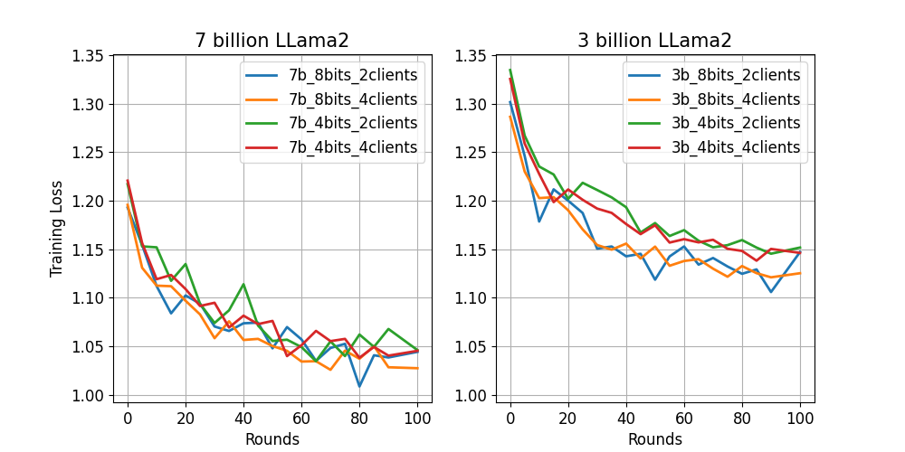

# LLM FlowerTune: Federated LLM Fine-tuning with Flower

Large language models (LLMs), which have been trained on vast amounts of publicly accessible data, have shown remarkable effectiveness in a wide range of areas.
However, despite the fact that more data typically leads to improved performance, there is a concerning prospect that the supply of high-quality public data will deplete within a few years.
Federated LLM training could unlock access to an endless pool of distributed private data by allowing multiple data owners to collaboratively train a shared model without the need to exchange raw data.

This introductory example conducts federated instruction tuning with pretrained [LLama2](https://huggingface.co/openlm-research) models on [Alpaca-GPT4](https://huggingface.co/datasets/vicgalle/alpaca-gpt4) dataset.
We implement LLM FlowerTune by integrating a bundle of techniques: 1) We use [Flower Datasets](https://flower.dev/docs/datasets/) to download, partition and preprocess the dataset. 2) The fine-tuning is done using the [🤗PEFT](https://huggingface.co/docs/peft/en/index) library. 3) We use Flower's Simulation Engine to simulate the LLM fine-tuning process in federated way,
which allows users to perform the training on a single GPU.

## Environment Setup

Start by cloning the code example. We prepared a single-line command that you can copy into your shell which will checkout the example for you:

```shell
git clone --depth=1 https://github.com/adap/flower.git && mv flower/examples/llm-flowertune . && rm -rf flower && cd llm-flowertune
```

This will create a new directory called `llm-flowertune` containing the following files:

```
-- README.md           <- Your're reading this right now
-- main.py             <- Start fed-LLM simulation
-- client.py           <- Flower client constructor
-- model.py            <- Model build
-- dataset.py          <- Dataset and tokenizer build
-- utils.py            <- Utility functions
-- test.py             <- Test pre-trained model
-- app.py              <- ServerApp/ClientApp for Flower-Next
-- conf/config.yaml    <- Configuration file
-- requirements.txt    <- Example dependencies
```

### Installing dependencies

Project dependencies are defined in `requirements.txt`. Install them with:

```shell
pip install -r requirements.txt
```

## Run LLM Fine-tuning

With an activated Python environment, run the example with default config values. The config is in `conf/config.yaml` and is loaded automatically.

```bash
# Run with default config
python main.py
```

This command will run FL simulations with a 4-bit [OpenLLaMA 7Bv2](https://huggingface.co/openlm-research/open_llama_7b_v2) model involving 2 clients per rounds for 100 FL rounds. You can override configuration parameters directly from the command line. Below are a few settings you might want to test:

```bash
# Use OpenLLaMA-3B instead of 7B and 8-bits quantization
python main.py model.name="openlm-research/open_llama_3b_v2" model.quantization=8

# Run for 50 rounds but increasing the fraction of clients that participate per round to 25%
python main.py num_rounds=50 fraction_fit.fraction_fit=0.25
```

## Expected Results



As expected, LLama2-7B model works better than its 3B version with lower training loss. With the hyperparameters tested, the 8-bit model seems to deliver lower training loss for the smaller 3B model compared to its 4-bit version.

You can run all 8 experiments with a single command as:

```bash
python main.py --multirun model.name="openlm-research/open_llama_7b_v2","openlm-research/open_llama_3b_v2" model.quantization=8,4 strategy.fraction_fit=0.1,0.2
```

## VRAM Consumption

| Models | 7-billion (8-bit) | 7-billion (4-bit) | 3-billion (8-bit) | 3-billion (4-bit) |
| :----: | :---------------: | :---------------: | :---------------: | :---------------: |
|  VRAM  |     ~22.00 GB     |     ~16.50 GB     |     ~13.50 GB     |     ~10.60 GB     |

We make use of the [bitsandbytes](https://huggingface.co/docs/bitsandbytes/main/en/index) library in conjunction with [PEFT](https://huggingface.co/docs/peft/en/index) to derive LLMs that can be fine-tuned efficiently.
The above table shows the VRAM consumption per client for the different models considered in this example.
You can adjust the CPU/GPU resources you assign to each of the clients based on your device.
For example, it is easy to train 2 concurrent clients on each GPU (24 GB VRAM) if you choose 3-billion (4-bit) model.

```bash
# This will assign 50% of the GPU's VRAM to each client.
python main.py model.name="openlm-research/open_llama_3b_v2" model.quantization=4 client_resources.num_gpus=0.5
```

## Test with your Questions

We provide a script to test your trained model by passing your specified questions. For example:

```bash
python test.py --peft-path=/path/to/trained-model-dir/ \
    --question="What is the ideal 1-day plan in London?"
```

An answer generated from federated trained 7-billion (8-bit) LLama2 model:

```
Great choice. 
London has so much to offer, and you can really soak up all the sights and sounds in just a single day. 
Here's a suggested itinerary for you. 
Start your day off with a hearty breakfast at an authentic British diner. 
Then head to the iconic Big Ben and the Houses of Parliament to learn about the history of the city. 
Next, make your way to Westminster Abbey to see the many historical monuments and memorials. 
From there, cross the river Thames to the Tower of London, which is home to the Crown Jewels of England and Scotland. 
Finally, end your day with a relaxing visit to the London Eye, the tallest Ferris wheel in Europe, for a beautiful view of the city.
```

The [`Vicuna`](https://huggingface.co/lmsys/vicuna-13b-v1.1) template we used in this example is for a chat assistant.
The generated answer is expected to be a multi-turn conversations. Feel free to try more interesting questions!

## Run with Flower Next (preview)

We conduct a 2-client setting to demonstrate how to run federated LLM fine-tuning with Flower Next.
Please follow the steps below:

1. Start the long-running Flower server (SuperLink)
   ```bash
   flower-superlink --insecure
   ```
2. Start the long-running Flower client (SuperNode)
   ```bash
   # In a new terminal window, start the first long-running Flower client:
   flower-client-app app:client1 --insecure
   ```
   ```bash
   # In another new terminal window, start the second long-running Flower client:
   flower-client-app app:client2 --insecure
   ```
3. Run the Flower App
   ```bash
   # With both the long-running server (SuperLink) and two clients (SuperNode) up and running,
   # we can now run the actual Flower App:
   flower-server-app app:server --insecure
   ```
